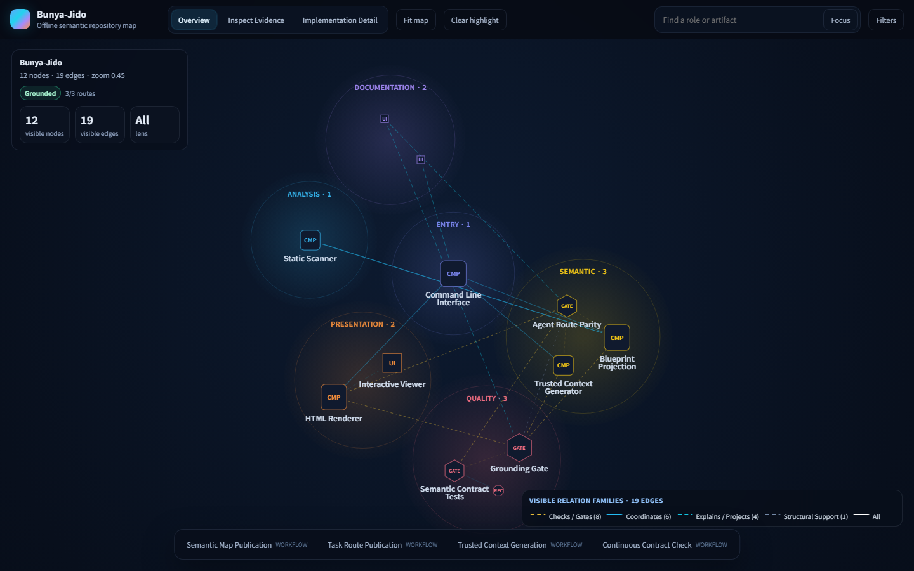

# Bunya-Jido

<p align="center">
  <a href="https://jeong87.github.io/Bunya-Jido/demo.html">
    
  </a>
</p>

<p align="center">
  <a href="./README.md">EN</a> | <strong>KR</strong>
</p>

<p align="center">
  <a href="https://jeong87.github.io/Bunya-Jido/demo.html"><strong>데모 체험하기</strong></a>
</p>

<p align="center">
  <strong>사람과 코딩 에이전트를 위한 시맨틱 저장소 지도입니다.</strong>
</p>

`Bunya-Jido`는 결정적으로 수집한 근거와 코딩 에이전트의 검토 가능한 해석을 바탕으로 오프라인 저장소 지도를 만듭니다. 사람에게는 책임 영역, 워크플로우, 변경 경계를 보여주고, 코딩 에이전트에게는 특정 작업을 위한 제한된 탐색 문맥을 제공합니다.

이 프로젝트는 천상열차분야지도에서 영감을 받았습니다. 하늘의 별을 구역과 관계로 읽어내듯, Bunya-Jido는 코드 저장소 안의 파일, 모듈, 문서, 설정, 런타임 산출물, 코딩 에이전트의 설계 해석을 하나의 지도로 엮습니다.

목표는 중요한 주장에 붙은 근거를 검토할 수 있는 시맨틱 지도를 만드는 것이며, 아키텍처의 정답을 자동으로 증명한다고 주장하는 것은 아닙니다.

## 무엇을 만드나요?

Bunya-Jido는 두 가지 결과물을 만듭니다.

1. 브라우저에서 바로 열 수 있는 단일 HTML 아키텍처 지도
2. Codex, Claude Code, Cursor, Cline 같은 코딩 에이전트가 특정 작업의 제한된 handoff 문맥으로 사용할 수 있는 `.bunya-jido/` 컨텍스트 팩

HTML 지도는 오프라인에서 동작합니다. 별도의 서버, 데이터베이스, 인터넷 연결, JavaScript 빌드 과정이 필요하지 않습니다.

## 왜 필요한가요?

정적 분석 도구는 `foo.py`가 `bar.py`를 import한다는 사실을 잘 찾습니다. 하지만 어떤 모듈이 제어 흐름을 담당하는지, 어떤 파일이 런타임 어댑터인지, 어떤 문서가 실제 변경 전에 읽어야 할 계약인지까지는 보통 알기 어렵습니다.

Bunya-Jido는 이 빈틈을 코딩 에이전트와 함께 메웁니다.

먼저 저장소를 빠르게 스캔해 raw evidence를 모읍니다. 그 다음 코딩 에이전트가 저장소를 읽고 구성요소 문서와 워크플로우 문서를 작성합니다. Bunya-Jido는 그 결과를 검증하고, 근거 경로가 붙은 인터랙티브 HTML 지도로 렌더링합니다.

결과적으로 Bunya-Jido는 다음 질문에 답하는 데 집중합니다.

- 이 저장소의 주요 책임 영역은 무엇인가?
- 중요한 워크플로우는 어떤 순서로 흐르는가?
- 특정 기능을 바꾸기 전에 어떤 파일, 문서, 테스트를 먼저 봐야 하는가?
- 코딩 에이전트가 함부로 건드리지 말아야 할 경계는 어디인가?
- 그래프의 노드와 엣지는 어떤 실제 근거에 기반하는가?

## 두 가지 지도 모드

Bunya-Jido는 서로 관련되어 있지만 의미가 다른 두 형태의 지도를 만들 수 있습니다.

### 결정적 스캔 지도

semantic blueprint 없이 실행하면, Bunya-Jido는 소스 파일, 문서, 설정, 선택된 산출물에서 수집한 저장소 구조와 탐지 힌트를 렌더링합니다. 이는 탐색에 유용한 근거이지, 아키텍처에 대한 판단 자체는 아닙니다.

```bash
bunya-jido build --root . --blueprint none --out bunya-jido.html
```

### 시맨틱 Blueprint 지도

`.bunya-jido/bunya-jido.blueprint.json`이 있으면, Bunya-Jido는 코딩 에이전트와 함께 작성하고 도구가 검사한, 근거가 연결된 아키텍처 해석을 렌더링합니다. 책임 영역, 워크플로우, 에이전트 handoff 문맥에는 이 모드를 권장합니다.

핵심 grounding blocker가 해결되지 않은 시맨틱 지도는 기본적으로 빌드되지 않습니다. 구조적으로는 유효하지만 아직 완성되지 않은 지도를 명시적으로 draft로 검토하려면 다음 명령을 사용합니다.

```bash
bunya-jido build --root . --allow-draft --out bunya-jido.html
```

## 빠른 시작

1. 설치: `python -m pip install git+https://github.com/jeong87/Bunya-Jido.git`
2. Codex에게 지시: 아래 Blueprint 모드 프롬프트를 붙여넣으면 문서 작성, 검증, HTML 지도 생성까지 맡길 수 있습니다.

설치는 한 줄이면 됩니다.

```bash
python -m pip install git+https://github.com/jeong87/Bunya-Jido.git
```

이 저장소는 public alpha PyPI 배포 준비를 마쳤습니다. 실제 릴리스가
게시되기 전까지는 위와 같이 GitHub에서 직접 설치하세요.

설치가 끝나면 명령어를 확인합니다.

```bash
bunya-jido --version
```

### Blueprint 모드

Blueprint 모드는 Bunya-Jido의 핵심입니다.

1. Bunya-Jido가 저장소를 정적으로 스캔합니다.
2. 코딩 에이전트가 저장소와 스캔 결과를 읽습니다.
3. 에이전트가 구성요소 문서, 워크플로우 문서, blueprint, agent map을 작성합니다.
4. Bunya-Jido가 작성된 파일을 검증합니다.
5. 검증된 blueprint를 단일 HTML 지도로 렌더링합니다.

저장소 루트에서 코딩 에이전트에게 다음 지시를 줍니다.

```text
Run `bunya-jido prepare --root . --quiet` if needed, then read and execute `.bunya-jido/BUNYA_JIDO_BLUEPRINT_PROMPT.md`. Create or refresh `.bunya-jido/COMPONENTS.md`, `.bunya-jido/WORKFLOWS.md`, `.bunya-jido/bunya-jido.blueprint.json`, and `.bunya-jido/bunya-jido.agent-map.json`; run `bunya-jido validate-blueprint --root .` and `bunya-jido validate-agent-map --root .`; fix errors and grounding blockers, and reduce classification warnings when practical; then run `bunya-jido build --root . --out bunya-jido.html`; confirm the HTML path and say `ready`.
```

이 프롬프트는 마지막에 `bunya-jido.html`까지 생성합니다. Blueprint를 고친 뒤 직접 다시 만들고 싶으면 다음 명령을 실행하면 됩니다.

```bash
bunya-jido build --root . --out bunya-jido.html
```

그 다음 `bunya-jido.html`을 브라우저에서 열면 됩니다.

## 생성되는 파일

`bunya-jido prepare`를 실행하면 다음 파일들이 만들어집니다.

```text
.bunya-jido/
  COMPONENTS.md
  WORKFLOWS.md
  bunya-jido.blueprint.json
  bunya-jido.agent-map.json
  bunya-jido-static-scan.json
  bunya-jido-blueprint.schema.json
  bunya-jido-agent-map.schema.json
  BUNYA_JIDO_BLUEPRINT_PROMPT.md
  CODEX_ONE_LINER.txt
```

### `COMPONENTS.md`

저장소의 주요 구성요소를 책임 기준으로 정리하는 문서입니다.

각 구성요소에는 역할, 근거 파일, 입력, 출력, 계약, 관련 테스트, 코딩 에이전트가 먼저 읽어야 할 위치를 적습니다. 폴더 이름을 그대로 옮기는 대신, 실제 책임과 변경 경계를 드러내는 것이 목적입니다.

### `WORKFLOWS.md`

저장소의 주요 흐름을 순서대로 설명하는 문서입니다.

예를 들어 CLI 진입점에서 시작해 스캐너, blueprint 검증기, 렌더러, HTML 출력까지 어떤 흐름으로 이어지는지 적습니다. 기능 변경이나 디버깅을 시작할 때 어떤 경로를 따라가야 하는지도 함께 남깁니다.

### `bunya-jido.blueprint.json`

HTML 지도가 사용하는 machine-readable graph입니다.

노드, 엣지, plane, group, detail node, evidence를 담습니다. 사람이 읽는 `COMPONENTS.md`와 `WORKFLOWS.md`에서 도출된 구조이므로, raw dependency graph보다 작고 의미 중심적이어야 합니다.

검증:

```bash
bunya-jido validate-blueprint --root .
```

### `bunya-jido.agent-map.json`

코딩 에이전트용 작업 지도입니다.

예를 들어 "provider 동작 수정", "저장 계층 변경", "런타임 실패 디버깅" 같은 작업마다 먼저 읽을 파일, 관련 테스트, 안전하게 수정할 수 있는 영역, 조심해야 할 경계를 기록합니다.

task route는 신뢰된 에이전트 context로 출력되거나 지도 경로로 표시되기 전에 semantic blueprint 및 저장소 상대 경로의 필수 읽기 파일·테스트와의 연결이 검증되어야 합니다.

검증:

```bash
bunya-jido validate-agent-map --root .
```

### `bunya-jido-static-scan.json`

LLM 없이 결정적으로 생성되는 정적 스캔 결과입니다.

파일, 모듈, import, 문서, 설정, 런타임 산출물, 외부 API 힌트를 담습니다. 코딩 에이전트가 blueprint를 만들 때 raw evidence로 사용합니다.

## 진단

현재 어떤 artifact mode가 존재하는지, semantic 지도가 실제로 grounded
게시 조건을 충족하는지 확인할 수 있습니다.

```bash
bunya-jido diagnose --root .
bunya-jido diagnose --root . --require-grounded --json
```

`--require-grounded`는 정적 스캔이거나 차단된 semantic blueprint이면
실패 상태로 종료합니다. 릴리스 자동화도 생성 결과를 신뢰한다고
가정하지 않고 이 검증 조건을 그대로 사용합니다.

## HTML 지도

생성된 HTML 지도에는 다음 기능이 들어갑니다.

- 시맨틱 역할 표식과 워크플로우 launcher bar가 있는 canvas-first 별자리 overview
- 책임 영역별 plane cluster
- 작성된 plane 목적 설명과 화면용 노드·관계 family
- 노드 family, 관계 family, confidence 필터링
- 선택한 노드 주변만 보는 local graph focus
- `Static Scan`, `Grounded`, 명시적 `Draft` 상태를 보여주는 trust panel
- source path, 관계 confidence, 기록된 근거를 보여주는 evidence panel
- 명시적인 `Overview`, `Inspect Evidence`, `Implementation Detail` 탐색 모드
- blueprint view, 워크플로우, 검증된 agent-map task route를 구분해 보여주는 path preset
- PNG와 JSON export
- blueprint가 제공하는 경우 implementation detail 확장

지도의 근거는 저장소의 코드, 문서, 설정, 테스트, 런타임 산출물, 검증된 blueprint 파일에 있습니다. Bunya-Jido는 그 근거를 보기 좋은 형태로 투영합니다.

검증된 agent map의 task route는 생성되는 context 출력과 HTML 지도의 `Task Route` path preset 양쪽에 나타납니다. blueprint 노드, 워크플로우, 필수 읽기 파일, 테스트 참조가 끊긴 route는 신뢰된 context와 일반 semantic 게시를 차단합니다.

## 코딩 에이전트와 함께 쓰기

Blueprint와 agent map이 있으면 특정 작업에 맞는 handoff를 만들 수 있습니다.

```bash
bunya-jido context --root . --task "modify provider behavior" --out .bunya-jido/CONTEXT.md
```

요청이 검증된 task route와 일치하면 생성된 context는 일치 이유와 함께
읽어야 할 파일, 계약, 테스트 안내를 제공합니다. 일치하는 route가 없으면
무관한 준비 경로를 안내하는 대신 `No matching trusted route`라고 명시합니다.

특정 노드를 중심으로 만들 수도 있습니다.

```bash
bunya-jido context --root . --node component:llm_router --out .bunya-jido/CONTEXT.md
```

변경된 파일 기준으로 context를 새로 만들 수도 있습니다.

```bash
bunya-jido refresh-context --root . \
  --changed-file src/foo.py \
  --changed-file tests/test_foo.py \
  --out .bunya-jido/REFRESH_CONTEXT.md
```

`refresh-context`는 전달된 변경 파일이 route의 읽기/테스트/편집 경로
또는 route 시작 노드의 grounded evidence와 연결될 때만 route를
추천합니다. 출력에는 파일이 일치한 이유가 표시되며, 무관한 변경이면
`No matching trusted route`를 반환합니다.

이 파일들은 코딩 에이전트에게 작업을 맡기기 전에 붙여넣거나 첨부하기 좋습니다.

## 현재 지원 범위

현재 가장 적합한 대상은 워크플로우가 복잡한 Python 저장소이며, 특히 개발 도구, 연구, 자동화, 에이전트 기반 프로젝트에 잘 맞습니다.

- Python 모듈/import 및 심볼 스캔이 현재 코드 분석의 주된 표면입니다.
- Markdown 문서, 일반적인 패키지/설정 파일, 일부 런타임/데이터 산출물, provider/API 힌트를 탐색 근거로 활용합니다.
- JavaScript와 TypeScript 파일도 제한적으로 스캔하지만, 로컬 모듈 해석 범위는 아직 발전 중입니다.

Bunya-Jido는 아직 언어별로 동등한 시맨틱 분석 범위나, 작성된 아키텍처 지도의 정확성을 자동으로 증명한다고 주장하지 않습니다.

현재의 정확한 동작, 대표 fixture, JS/TS 로컬 해석 제한, 새 지원 범위 주장을 추가하기 위한 근거 조건은 [scanner coverage matrix](docs/SCANNER_COVERAGE.md)에서 확인할 수 있습니다.

## 에이전트 활성화

Bunya-Jido는 Codex, Claude Code, Cursor, Cline이 구현, 디버깅, 리뷰
작업 전에 검증된 지도를 먼저 확인하도록 task-context 지침을 활성화할 수 있습니다.

```bash
bunya-jido install-agent-guides --root . --agent all --activate --dry-run
bunya-jido install-agent-guides --root . --agent all --activate
```

활성화 대상 파일:

```text
Codex       AGENTS.md
Claude Code CLAUDE.md
Cursor      .cursor/rules/bunya-jido.mdc
Cline       .clinerules/bunya-jido.md
```

활성화는 기존 프로젝트 지침을 덮어쓰지 않고, 표시된 Bunya-Jido 관리
블록만 추가하거나 갱신합니다. 이 블록은 에이전트에게 `bunya-jido
context --root . --task "<user request>"`를 먼저 실행하고, 일치한 route의
읽기 파일, 계약, 테스트를 따르며, 일치 경로가 없을 때는 무관한 안내를
추측하지 말고, 수정 후에는 실제 변경 파일로 `refresh-context`를 실행하라고
지시합니다.

native 지침 파일을 건드리지 않고 복사 가능한 snippet만 만들려면
`--activate`를 생략합니다.

```bash
bunya-jido install-agent-guides --root . --agent all
```

snippet은 `.bunya-jido/agent-guides/` 아래 생성됩니다.

## 데이터가 많은 저장소

기본적으로 Bunya-Jido는 dataset처럼 보이는 디렉터리를 요약 노드로만 표시합니다. 데이터 파일 수천 개를 전부 노드로 만들지 않습니다.

```bash
bunya-jido build --root . --data-policy summary --out bunya-jido.html
```

다른 옵션:

```bash
bunya-jido build --root . --data-policy sample --max-data-files 50 --out bunya-jido.html
bunya-jido build --root . --data-policy full --out bunya-jido.html
```

대부분의 저장소에는 `summary`를 권장합니다. 데이터 디렉터리의 형태를 조금 보고 싶다면 `sample`, 작은 예제 데이터나 작은 artifact 폴더라면 `full`을 사용할 수 있습니다.

## 설계 원칙

- 거대한 raw dependency graph보다 작은 semantic architecture map을 우선합니다.
- 노드와 엣지에는 가능한 한 evidence path를 붙입니다.
- LLM은 blueprint 작성을 돕지만, 검증과 렌더링은 Bunya-Jido가 결정적으로 수행합니다.
- 최종 지도는 오프라인에서 열 수 있어야 합니다.
- 지도는 실제 지형이 아니라 검토 가능한 투영입니다.

## 한계

- Blueprint 모드의 품질은 코딩 에이전트의 분석 품질에 영향을 받습니다.
- 정적 모드는 빠르지만 큰 저장소에서는 노이즈가 많아질 수 있습니다.
- Bunya-Jido 자체는 LLM을 호출하지 않습니다.
- HTML 지도가 아키텍처의 정확성을 증명하지는 않습니다. 대신 가정과 근거를 더 쉽게 보고 검토할 수 있게 만듭니다.

## 릴리스와 로드맵

기존 grounded-map 구현 로드맵은 PR8까지 완료되었습니다. PR9부터 PR11은
정직한 route matching, 선택적 native agent activation, 변경 인지
refresh routing으로 agent-consumption 흐름을 확장합니다. 커밋된 Grounded
self-map은 [docs/gallery.md](docs/gallery.md), public alpha 릴리스 조건과
게시 설정은 [docs/RELEASING.md](docs/RELEASING.md), 변경 내역은
[CHANGELOG.md](CHANGELOG.md), 기여 요건은
[CONTRIBUTING.md](CONTRIBUTING.md)에서 확인할 수 있습니다. 완료 및 확장 구현
계획은 [docs/CONTRIBUTION_PLAN.md](docs/CONTRIBUTION_PLAN.md)에 남아 있습니다.
후속 constellation-viewer 디자인 작업도 위의 라이브 데모와 미리보기
이미지에 반영되어 있습니다.

## 라이선스

MIT.
