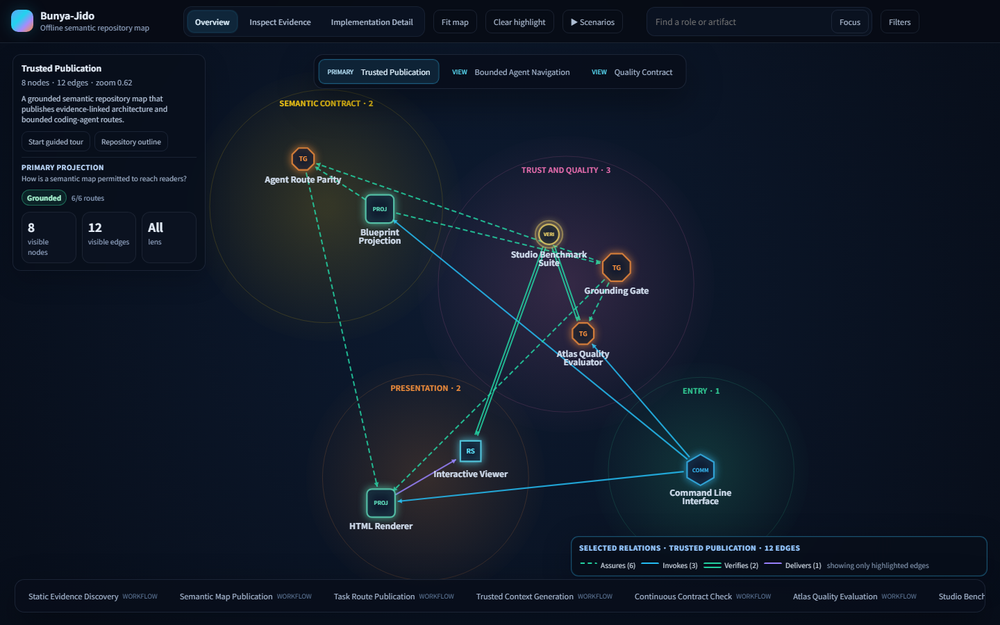
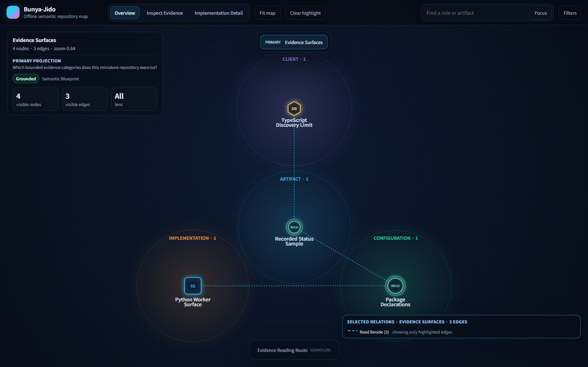
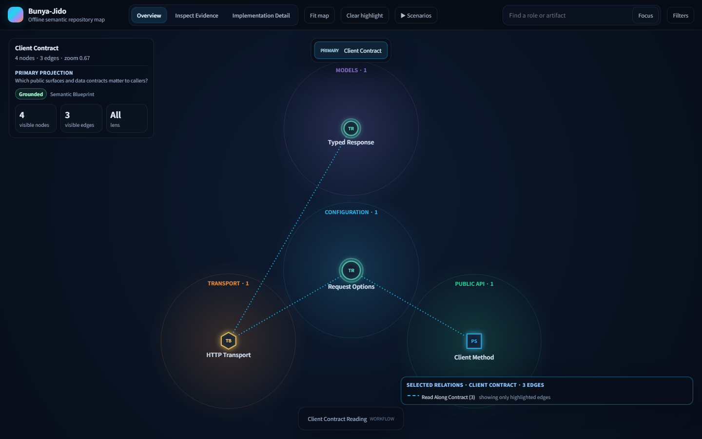
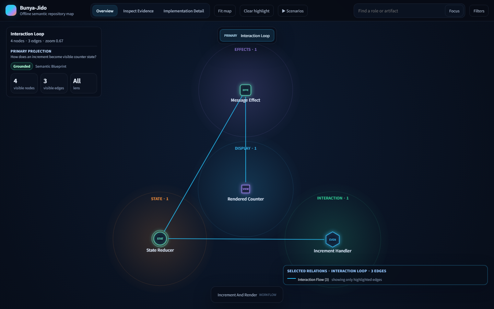
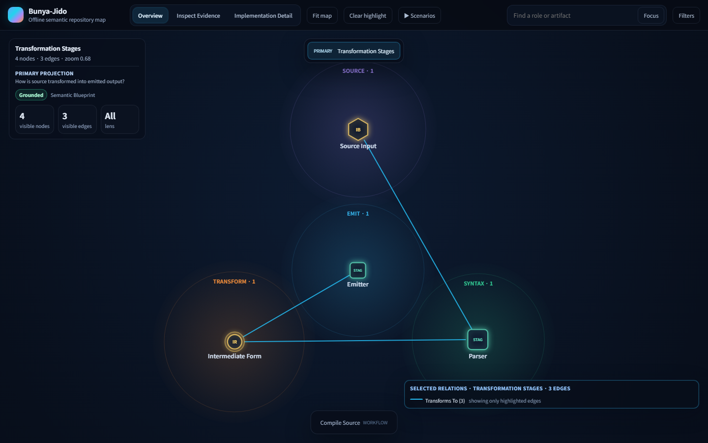
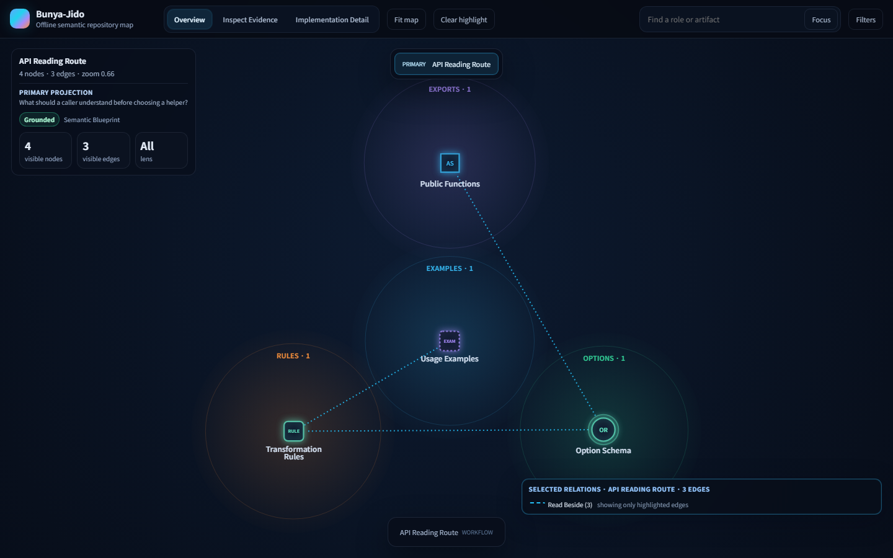

# Bunya-Jido Gallery

This gallery promotes only maps whose artifact mode and grounding record are
explicit. The committed example below is generated from evidence paths in this
repository and is protected by semantic golden tests.

## Grounded Self-Map: Bunya-Jido

| Record | Value |
|---|---|
| Artifact | Repository self-map |
| Source inputs | `.bunya-jido/REPOSITORY_THESIS.md`, `.bunya-jido/PROJECTIONS.md`, `.bunya-jido/SCENARIOS.md`, `.bunya-jido/bunya-jido.blueprint.json`, `.bunya-jido/bunya-jido.agent-map.json` |
| Artifact mode | `semantic_blueprint` |
| Atlas contract | Studio v2, primary projection `Trusted Publication`, machine-readable decision record, two behavioral scenarios |
| Grounding status | `grounded` |
| Atlas quality status | `passed`, with projection choice and narration honesty still review-required |
| Review status | Semantic artifact mechanically validated on July 18, 2026; refreshed browser capture pending |
| Semantic coverage | 15 nodes, 32 relationships, 5 core nodes, 15 critical relationships |
| Grounding metrics | 100% core-node evidence; 100% critical-relationship evidence |
| Agent routes | 8 of 8 routes validated and projected as `Task Route` paths with optional Studio reading context |
| Viewer surface | Studio constellation with authored projection tabs, scenario playback, semantic role glyphs, workflow launcher bar, and copyable trusted route context |
| Viewer disclosure | `Overview` by default; map controls and selected-item inspector open on demand |
| Screenshot capture | Previous 1440 x 900 `Overview` capture preserved; refresh pending a connected browser |
| Published output | `docs/demo.html` |

**Generation command:**

```bash
python -m bunya_jido validate-blueprint --root .
python -m bunya_jido validate-agent-map --root .
python -m bunya_jido evaluate-atlas-quality --root . --require-pass --json
python -m bunya_jido build --root . --max-files 0 --out docs/demo.html
```



**Intended lessons:**

- A semantic blueprint can publish a compact architecture view with directly inspectable repository evidence.
- The same committed artifact can expose workflows to humans and bounded task routes to coding agents.
- Grounded status is visible in the HTML output rather than being an undocumented build assumption.
- Studio projection and scenario labels are authored from this repository's thesis; playback carries a documented-workflow basis badge rather than claiming observed runtime traces.
- The blueprint retains the compared projections, scenario choices, and centrality risks in `atlas.decision_record`, while quality checks still leave editorial judgment review-required.
- Atlas-quality reporting keeps review-only narration signals separate from blockers and can write an optional local Markdown review summary.
- Benchmark evidence reporting keeps unsafe or unresolved runs out of token/time savings and treats synthetic timing results as measurement rather than routing-tuning instructions.
- Validated routes may connect a coding task to a relevant projection question and qualified scenario, and the viewer copies only this projected trusted context.
- Guarded Codex Run is a distinct execution component and maintenance route; only `MATCH` becomes writable, while fake-executable evidence remains explicitly separate from live sandbox proof.
- Provider hint observations now carry origin/type metadata, and generated prompt/schema example text cannot become a contextual overlay node.
- The benchmark suite exercises six different repository shapes so this promoted self-map is not the only quality target. See [`STUDIO_BENCHMARK.md`](STUDIO_BENCHMARK.md).
- The canvas-first overview keeps controls out of the initial reading surface while preserving them in an on-demand drawer.
- Zone fields, semantic role glyphs, and a restrained relation palette make the first read compact, while selected relationships retain their exact verb, confidence, and evidence in `Inspect Evidence`.

**Known limitations:**

- The published self-map uses `--max-files 0` to keep the promoted output limited to its reviewed semantic evidence. If a Studio author explicitly enables an auxiliary contextual overlay, provider nodes remain secondary and generated prompt/schema hints are filtered by provenance; source/config hints are still heuristic evidence, not verified integrations.
- This is a compact Python developer-tool repository. The cross-domain benchmark checks contract variety, but it is not equivalent to publishing independently reviewed maps for every ecosystem.
- `grounded` means the required evidence references resolve and the implemented publication policy passes; it is not automatic proof that every architectural interpretation is complete.

## Curated Miniature: Scanner Coverage Fixture

This second published item is grounded in the committed miniature repository
under `examples/coverage/`; unlike the self-map it deliberately does not claim
an ordered behavioral walkthrough.

| Record | Value |
|---|---|
| Artifact | Curated coverage-fixture Studio atlas |
| Source inputs | `examples/coverage/studio.blueprint.json` plus its referenced committed fixture files |
| Thesis | Evidence surfaces should be read without inventing an application lifecycle |
| Primary projection | `Evidence Surfaces` |
| Scenario policy | `none_with_reason` |
| Quality result | `passed`; this compact item omits a full Studio editorial workspace, so those omitted review inputs remain disclosed warnings |
| Known limitation | A compact scanner fixture demonstrates provenance handling, not a complete product architecture |
| Screenshot | [`gallery/coverage-fixture.png`](gallery/coverage-fixture.png) |
| Published HTML | [`gallery/coverage-fixture.html`](gallery/coverage-fixture.html) |

```bash
python -m bunya_jido validate-blueprint --root examples/coverage --blueprint examples/coverage/studio.blueprint.json
python -m bunya_jido evaluate-atlas-quality --root examples/coverage --blueprint examples/coverage/studio.blueprint.json --require-pass --json
python -m bunya_jido build --root examples/coverage --blueprint examples/coverage/studio.blueprint.json --max-files 0 --out docs/gallery/coverage-fixture.html
```



## Published Domain Miniatures

The following four committed miniatures turn the benchmark's different
repository readings into evidence-backed, inspectable Studio outputs. Each
miniature includes source evidence and its own `.bunya-jido` editorial inputs,
so it passes deterministic quality checks without borrowing the self-map's
interpretation.

### Small SDK / Client

| Record | Value |
|---|---|
| Artifact | Acorn Weather SDK curated miniature |
| Source inputs | `examples/gallery/sdk_client/` |
| Thesis | A public client surface translates caller options into a transport boundary and typed results |
| Primary projection | `Client Contract` |
| Scenario policy | `optional`; one `structural_tour` reading with `illustrative_tour` basis |
| Quality result | `passed`; zero deterministic warnings; structural narration remains review-required |
| Known limitation | Documents a caller-facing contract, not an observed HTTP exchange |
| Screenshot | [`gallery/sdk-client.png`](gallery/sdk-client.png) |
| Published HTML | [`gallery/sdk-client.html`](gallery/sdk-client.html) |



### Web / State Application

| Record | Value |
|---|---|
| Artifact | Pulse Counter curated miniature |
| Source inputs | `examples/gallery/web_state_app/` |
| Thesis | User intent updates authoritative state and drives a rendered response through a controlled effect |
| Primary projection | `Interaction Loop` |
| Scenario policy | `required`; one grounded `behavioral` walkthrough |
| Quality result | `passed`; zero deterministic warnings; projection choice remains review-required |
| Known limitation | Models one bounded counter interaction rather than a full web application |
| Screenshot | [`gallery/web-state-app.png`](gallery/web-state-app.png) |
| Published HTML | [`gallery/web-state-app.html`](gallery/web-state-app.html) |



### Compiler / Parser

| Record | Value |
|---|---|
| Artifact | Pebble Compiler curated miniature |
| Source inputs | `examples/gallery/compiler_parser/` |
| Thesis | Source input passes explicit transformation stages before a checked output is emitted |
| Primary projection | `Transformation Stages` |
| Scenario policy | `required`; one grounded `behavioral` pipeline walkthrough |
| Quality result | `passed`; zero deterministic warnings; projection choice remains review-required |
| Known limitation | Demonstrates the success path only, without parser-error recovery |
| Screenshot | [`gallery/compiler-parser.png`](gallery/compiler-parser.png) |
| Published HTML | [`gallery/compiler-parser.html`](gallery/compiler-parser.html) |



### Utility Library

| Record | Value |
|---|---|
| Artifact | Clear Text Utilities curated miniature |
| Source inputs | `examples/gallery/utility_library/` |
| Thesis | A small public function family applies documented transformations without claiming a lifecycle |
| Primary projection | `API Reading Route` |
| Scenario policy | `none_with_reason` |
| Quality result | `passed`; zero deterministic warnings; projection choice remains review-required |
| Known limitation | Shows a compact helper family, not package discovery across a broad library |
| Screenshot | [`gallery/utility-library.png`](gallery/utility-library.png) |
| Published HTML | [`gallery/utility-library.html`](gallery/utility-library.html) |



**Generation commands:**

```bash
python -m bunya_jido build --root examples/gallery/sdk_client --blueprint examples/gallery/sdk_client/.bunya-jido/bunya-jido.blueprint.json --max-files 0 --out docs/gallery/sdk-client.html
python -m bunya_jido build --root examples/gallery/web_state_app --blueprint examples/gallery/web_state_app/.bunya-jido/bunya-jido.blueprint.json --max-files 0 --out docs/gallery/web-state-app.html
python -m bunya_jido build --root examples/gallery/compiler_parser --blueprint examples/gallery/compiler_parser/.bunya-jido/bunya-jido.blueprint.json --max-files 0 --out docs/gallery/compiler-parser.html
python -m bunya_jido build --root examples/gallery/utility_library --blueprint examples/gallery/utility_library/.bunya-jido/bunya-jido.blueprint.json --max-files 0 --out docs/gallery/utility-library.html
```

## Fixture Policy

The minimal example remains a static-scan smoke fixture for command and
rendering behavior. `examples/coverage/` is promoted only as a curated,
evidence-backed miniature for scanner/provenance behavior. The four
`examples/gallery/` miniatures are promoted as reviewable evidence for
distinct SDK, UI-state, transformation-pipeline, and utility-library readings.
These examples establish that the renderer can honestly publish different
repository interpretations; they are not evidence of exhaustive ecosystem
support.

No sanitized complex-system map is promoted because a redistributable,
evidence-backed source has not been established. New gallery examples should
disclose their origin, review status, grounding result, and limitations before
publication.

## Publishing Workflow

`docs/demo.html`, `docs/gallery/*.html`, and their screenshots are reviewed,
committed gallery outputs. Before updating any promoted item, run its
validation, quality, and generation commands, inspect the resulting offline
HTML, refresh its clean `Overview` capture at 1440 x 900, and run:

```bash
python -m unittest tests.test_self_map
python -m bunya_jido diagnose --root . --require-grounded --json
python -m bunya_jido evaluate-atlas-quality --root . --require-pass --json
python -m unittest tests.test_gallery
```

After reviewed `docs/` changes merge to `main`,
`.github/workflows/pages.yml` deploys them automatically and remains available
for manual dispatch. It deploys only after the committed semantic self-map
test, strict grounded diagnostic, and Studio atlas-quality gate pass. The
Pages deployment publishes the reviewed artifact already in the repository;
it does not generate a new semantic interpretation during deployment.
